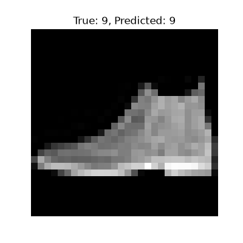

# Fashion-MNIST 服装分类（PyTorch + CNN）

# 项目简介
基于 PyTorch 实现的 Fashion-MNIST 服装图像分类器。使用卷积神经网络（CNN）对 10 类服饰（T 恤、牛仔裤、短靴等）进行分类。

# 技术栈
- Python 3.12
- PyTorch（GPU 加速）
- Matplotlib（可视化）

# 模型结构
- 两层卷积层（Conv2d）
- 两层池化层（MaxPool2d）
- 两层全连接层 + Dropout

# 训练结果
模型 ： 卷积神经网络 (CNN)    
测试准确率 ：91.36%

# 预测示例

# 如何运行
1. 克隆仓库
2. 安装依赖：pip install torch torchvision matplotlib
3. 运行：python cnn_Fashionmnist.py
